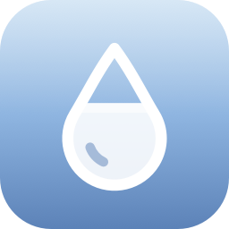

<p align="center">
  
</p>

<h1 align="center">Carafe</h1>

<p align="center">
  Une petite goutte dans la barre de menus de macOS pour penser à boire, sans y penser.
</p>

<p align="center">
  <a href="https://github.com/SebDubuy/Carafe/releases/latest/download/Carafe.dmg"><b>Télécharger pour macOS</b></a>
  ·
  macOS 13 et plus · Intel et Apple Silicon · gratuit et open source
</p>

---

Carafe vit uniquement dans la barre de menus. La goutte se remplit à chaque verre ajouté, et l'app te fait signe, sans insister, quand ça fait un moment que tu n'as rien bu.

## Fonctionnalités

- **Une goutte dans la barre de menus** qui se remplit au fil de la journée, avec en option « 1,2 / 2 L » ou « 60 % » à côté.
- **Un clic par verre** : tes tailles de verre en boutons (15, 25, 33, 50 cl par défaut, ou « Ma gourde – 75 cl »), plus une quantité libre. En cl ou en ml.
- **Objectif du jour** fixe (2 L par défaut) ou calculé selon ton poids (33 ml par kilo).
- **Rappel d'inactivité** après 45 min, 1 h, 1 h 30 ou 2 h sans verre.
- **Rappel de rythme** si tu as plus de 20 % de retard sur l'objectif réparti dans ta journée.
- **Actions dans la notification** : « + 25 cl » et « Rappeler dans 15 min ».
- **Discrète** : aucun rappel hors de ta plage horaire, quand l'écran est verrouillé ou une fois l'objectif atteint. Les notifications ne s'empilent jamais.
- **Ta semaine** : les 7 derniers jours en petites barres, ta série de jours d'affilée et la liste de tes verres du jour.
- **Remise à zéro à minuit**, même si le Mac dormait. L'historique est conservé.
- **Tout reste sur ton Mac** : pas de compte, pas de serveur, aucune donnée envoyée.

## Installation

1. Télécharge **[Carafe.dmg](https://github.com/SebDubuy/Carafe/releases/latest/download/Carafe.dmg)**.
2. Ouvre-le et glisse **Carafe** dans **Applications**.
3. Au premier lancement, macOS indique qu'il ne peut pas vérifier le développeur : Carafe n'est pas encore notarisée par Apple. Pour l'ouvrir quand même :
   - fais **clic droit › Ouvrir** sur Carafe dans le dossier Applications, puis confirme ;
   - ou va dans **Réglages Système › Confidentialité et sécurité** et clique sur **Ouvrir quand même**.
4. Autorise les notifications quand macOS le demande, pour recevoir les rappels.

Carafe apparaît alors sous forme de goutte dans la barre de menus. Tu peux la lancer au démarrage depuis ses réglages.

## Compiler depuis le code

Il faut Xcode et [XcodeGen](https://github.com/yonaskolb/XcodeGen) (`brew install xcodegen`).

```sh
xcodegen generate
open Carafe.xcodeproj        # puis ⌘R pour lancer, ⌘U pour les tests
./scripts/make-dmg.sh        # fabrique dist/Carafe.dmg
```

Le mode debug s'ouvre avec **Option + clic sur « Réglages… »** : il ramène les délais de rappel à 1 minute, simule un changement de jour et affiche l'état des rappels.

## Licence

[MIT](LICENSE) © 2026 Sébastien Dubuy
